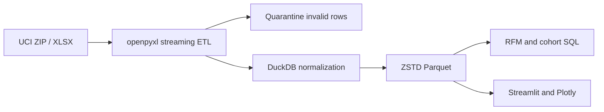

# Online Retail Customer Analytics

基于 106 万条真实在线零售交易构建的端到端数据分析项目。项目覆盖数据下载、Excel 流式清洗、质量审计、DuckDB/Parquet 分析、RFM 客户分层、同期群留存和 Streamlit 可视化。

## 项目结果

在完整数据范围内，按照“非取消订单、数量大于 0、单价大于 0”定义有效销售：

| 指标 | 结果 |
| --- | ---: |
| 原始交易行 | 1,067,371 |
| 有效销售行 | 1,041,670 |
| 有效收入 | GBP 20,972,594.55 |
| 有效订单 | 40,077 |
| 已识别客户 | 5,878 |
| 复购客户比例 | 72.39% |
| 取消记录 | 19,494 |
| 缺失客户 ID | 243,007 |

这些结果来自历史数据，仅用于分析方法展示，不代表当前市场表现。

## 数据来源

- 数据集：[UCI Online Retail II](https://archive.ics.uci.edu/dataset/502/online+retail+ii)
- DOI：[10.24432/C5CG6D](https://doi.org/10.24432/C5CG6D)
- 创建者：Daqing Chen
- 数据范围：2009-12-01 至 2011-12-09
- 官方记录数：1,067,371

该数据集记录英国一家非实体零售商的两年交易。原始数据没有浏览和加购事件，因此项目不会伪造转化漏斗，而是围绕真实可观测的交易、客户和商品指标展开。

## 技术架构



技术栈：

- Python 3.13
- DuckDB 1.5
- Parquet + ZSTD
- openpyxl
- Pandas
- Plotly
- Streamlit
- unittest

## 分析内容

### 销售概览

- 收入、订单数、客户数、客单价和复购比例
- 月度收入与订单趋势
- 国家/地区市场表现

### 客户分析

- Recency、Frequency、Monetary 指标
- 五分位 RFM 评分
- Champions、Loyal、At risk 等客户分层
- 首次购买月份同期群和 12 个月留存率

### 商品分析

- 商品收入、销量和覆盖订单数
- 高收入商品排名
- 可筛选的商品明细表

### 数据质量

- 取消发票
- 缺失客户 ID
- 非正数数量
- 非正数价格
- 无法解析的原始行隔离

## 本地运行

创建虚拟环境并安装依赖：

```powershell
python -m venv .venv
.\.venv\Scripts\python.exe -m pip install -r requirements.txt
```

下载 UCI 官方数据：

```powershell
.\.venv\Scripts\python.exe scripts\download_uci_retail.py
```

构建清洗后的 Parquet：

```powershell
.\.venv\Scripts\python.exe -m ecommerce_analytics.retail_etl `
  --input "data\raw\online_retail_ii\online_retail_II.xlsx" `
  --output "data\processed\retail_transactions.parquet"
```

启动 Dashboard：

```powershell
.\.venv\Scripts\python.exe -m streamlit run dashboard.py
```

打开 `http://127.0.0.1:8501`。

## 测试

```powershell
.\.venv\Scripts\python.exe -m unittest discover -s tests -v
```

测试使用临时 Excel 工作簿验证：

- 有效销售判定
- 取消订单识别
- 缺失客户 ID
- 非正数价格
- 收入计算
- Parquet 输出和质量摘要

## 项目结构

```text
.
|-- .streamlit/
|   `-- config.toml
|-- ecommerce_analytics/
|   |-- __init__.py
|   `-- retail_etl.py
|-- scripts/
|   `-- download_uci_retail.py
|-- tests/
|   `-- test_retail_etl.py
|-- dashboard.py
|-- requirements.txt
`-- README.md
```

原始数据、Parquet 和质量报告位于 `data/`，并通过 `.gitignore` 排除，避免把大文件提交到 GitHub。

## 局限性

- 数据来自 2009-2011 年，不能推断当前零售市场水平。
- 缺失客户 ID 的交易不能进入客户留存和 RFM 分析。
- 数据只包含交易，没有页面访问、广告曝光或加购事件。
- RFM 分层用于运营优先级，不代表因果效果或客户终身价值预测。

